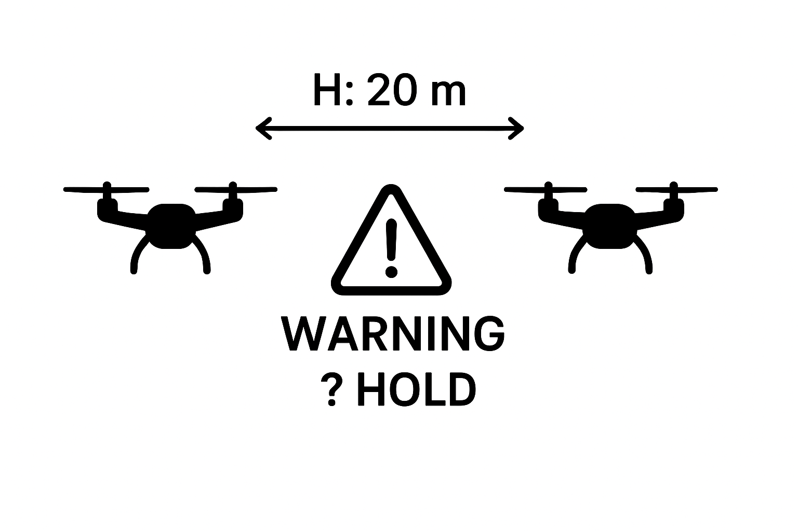

# 🚁 Drone Proximity Monitoring API

This branch provides a Flask-based REST API for monitoring the proximity of two MAVLink-enabled drones.
It continuously reads GPS and altitude data from both drones, computes horizontal and vertical distances, and raises warnings when thresholds are breached.

If both the horizontal distance (H) and vertical distance (V) fall below defined thresholds, the API automatically requests both drones to switch to Hold/Loiter mode, preventing further approach.

## ✨ Features

- Connects to two MAVLink-enabled drones via UDP or serial

- Exposes REST API to check proximity

- Computes:

 - Horizontal distance (H) via haversine formula

 - Vertical distance (V) via altitude difference

- Returns JSON with status:

 - SAFE if drones are separated

 - DANGER if within thresholds (Loiter/Hold command triggered)

- Deployable via Docker + Docker Compose

- Optional dashboard available at `http://127.0.0.1:8000/api/v1/monitor?conn1=udp:0.0.0.0:14540&conn2=udp:0.0.0.0:14541&hthresh=7&vthresh=5`

## Requirements

- Docker
- Docker Compose

## Install Dependencies (installed in container)

- `pymavlink`

- `flask`

- `flask-cors`

- `marshmallow`

## Usage

### 🚀 Setup with Docker
### 1. Clone Git Repository
Clone this repository using:
- git clone `http://192.168.1.9:3001/awaisk65/NAHL-proximity_warning.git`
Checkout branch:
- git checkout 'flask_api'

### 2. Build and Start Docker
From the project root (where Dockerfile and docker-compose.yml exist):
- docker compose build
- docker compose up -d

This starts the API at:
`http://127.0.0.1:8000/api/v1/monitor?conn1=udp:0.0.0.0:14540&conn2=udp:0.0.0.0:14541&hthresh=7&vthresh=5`

## 🔹 API Endpoints
### 1. Proximity Check
**GET** /api/v1/monitor

Query parameters:

- `conn1` → Connection string for Drone 1 (e.g., `udp:0.0.0.0:14540`)

- `conn2` → Connection string for Drone 2 (e.g., `udp:0.0.0.0:14541`)

- `hthresh` → Horizontal threshold (meters)

- `vthresh` → Vertical threshold (meters)

Example:

`curl "http://127.0.0.1:8000/api/v1/monitor?conn1=udp:0.0.0.0:14540&conn2=udp:0.0.0.0:14541&hthresh=7&vthresh=5"`

### 2. Dashboard
A dashboard is available at:
`http://127.0.0.1:8000/api/v1/monitor?conn1=udp:0.0.0.0:14540&conn2=udp:0.0.0.0:14541&hthresh=7&vthresh=5`

## Proximity Warning Diagram

## Notes

- Mode numbers may differ between PX4 and ArduPilot. Adjust `5` in `_set_mode_hold()` if HOLD mode does not map correctly on your autopilot.

- Ensure both drones are streaming MAVLink data over UDP/TCP before running the script.

- Use in simulation first (e.g., SITL + Gazebo) before deploying on real hardware.

## License

This project is released under the MIT License. See the [LICENSE](LICENSE) file for details.
